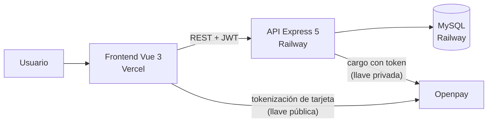

# FMDS — Plataforma de Eventos y Congresos

Plataforma web full-stack para la **Federación Mexicana de Desarrolladores de Software (FMDS)**: difusión de congresos, venta de boletos en línea con pasarela de pagos, gestión de contenido y panel de administración.

Desarrollada como proyecto de prácticas profesionales (UTM, 2026).

| Repositorio | Tecnología | Deploy |
|---|---|---|
| [fmds-frontend](https://github.com/Will010906/fmds-frontend) | Vue 3 + Vite | Vercel |
| [fmds-backend](https://github.com/Will010906/fmds-backend) | Node.js + Express 5 | Railway |

---

## Arquitectura



- **SPA en Vue 3** (`<script setup>`, Vue Router con lazy loading y guards de navegación por rol).
- **API REST en Express 5** con patrón modelo–controlador–rutas por entidad.
- **MySQL** con pool de conexiones (mysql2) y transacciones SQL para las compras.
- **Pagos con Openpay** (modo sandbox): la tarjeta se tokeniza en el navegador con la llave pública — el número de tarjeta **nunca toca nuestro servidor** — y el cargo se ejecuta del lado del servidor con la llave privada, incluyendo el `device_session_id` de la herramienta antifraude.

## Funcionalidades

**Sitio público**
- Home con countdown en vivo al próximo evento, estadísticas animadas y boletín funcional.
- Eventos, agenda por días, speakers (con fotos o placeholder de iniciales), artículos, cursos y galería — todo el contenido viene de la base de datos.
- Diseño responsivo completo, animaciones de scroll y transiciones entre páginas, con soporte de `prefers-reduced-motion`.

**Compras**
- Compra de boletos con cuenta o **como invitado** (solo nombre y correo): al invitado se le crea una cuenta interna que puede reclamar después registrándose con el mismo correo, y sus boletos aparecen automáticamente.
- Stock de boletos que se descuenta con transacción SQL (atómica).
- Página **Mis boletos** con folio, evento, cantidad y monto de cada compra.

**Panel de administración** (rol Administrador)
- 8 módulos CRUD: Eventos, Artículos, Speakers, Agenda, Cursos, Ventas, Usuarios y Boletín.

**Seguridad**
- Autenticación con **JWT** (expiración 8 h) y contraseñas con **bcrypt**.
- Autorización por roles en middleware (`verificarToken`, `soloAdmin`, `tokenOpcional`).
- **Rate limiting** en login (10 intentos / 15 min por IP) contra fuerza bruta.
- Cabeceras de seguridad HTTP con **helmet**.
- Cierre de sesión automático en el frontend cuando el token expira.

## Endpoints principales

| Método | Ruta | Acceso |
|---|---|---|
| POST | `/api/auth/login` · `/api/auth/registro` | Público |
| GET | `/api/eventos` · `/api/speakers` · `/api/articulos` · `/api/sesiones` · `/api/cursos` | Público |
| POST/PUT/DELETE | los anteriores | Admin |
| POST | `/api/checkout` | Público (sesión opcional) |
| GET | `/api/transacciones/mias` | Usuario autenticado |
| GET | `/api/transacciones` | Admin |
| GET/PUT/DELETE | `/api/usuarios` | Admin |
| POST | `/api/suscriptores` | Público |

## Correr en local

**Backend** (`/backend`):

```bash
npm install
npm run dev        # nodemon en http://localhost:3000
```

Variables de entorno (`.env`):

```env
DB_HOST=...
DB_PORT=3306
DB_USER=...
DB_PASSWORD=...
DB_NAME=...
JWT_SECRET=...
OPENPAY_MERCHANT_ID=...
OPENPAY_PRIVATE_KEY=...
# Para producción real: OPENPAY_BASE_URL=https://api.openpay.mx (default: sandbox)
```

**Frontend** (`/frontend`):

```bash
npm install
npm run dev        # Vite en http://localhost:5173
```

Variables de entorno (`.env`):

```env
VITE_OPENPAY_MERCHANT_ID=...
VITE_OPENPAY_PUBLIC_KEY=...
```

Los scripts SQL de creación y datos semilla están en `backend/sql/`.

## Probar la pasarela de pagos (sandbox)

Openpay corre en modo sandbox: el dinero es simulado. Tarjetas de prueba oficiales:

| Tarjeta | Resultado |
|---|---|
| `4111 1111 1111 1111` | Aprobada |
| `4444 4444 4444 4448` | Rechazada — fondos insuficientes |
| `4000 0000 0000 0069` | Rechazada — tarjeta expirada |

Vigencia: cualquier fecha futura. CVV: cualquier número de 3 dígitos.

## Deploy

- **Backend**: push a `main` de fmds-backend → Railway despliega automáticamente. MySQL vive en Railway (conexión por proxy público).
- **Frontend**: deploy a Vercel desde fmds-frontend.
